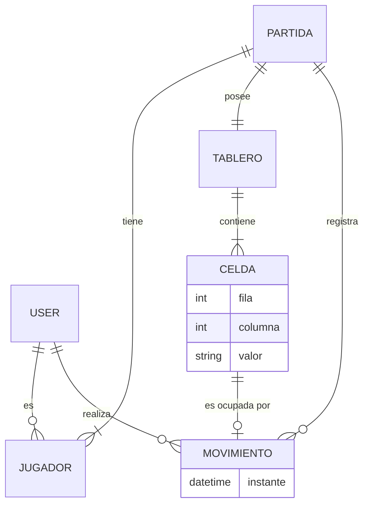

# Tres en raya

**Tres en raya** es una implementación backend del juego clásico **Tic-Tac-Toe**, creada como parte de una entrevista técnica para desarrollador en **Phicus**. El proyecto está hecho en Django y Django REST Framework, y muestra cómo gestionar partidas, jugadores, movimientos y el estado del tablero mediante una API REST.

## Índice

- [Base de datos](#base-de-datos)
- [Herramientas](#herramientas)
- [Estructura](#estructura)
- [Cómo ejecutarlo](#cómo-ejecutarlo)
- [Endpoints](#endpoints)
- [Mejora futura](#mejora-futura)

## Base de datos

La aplicación usa el ORM de Django con un modelo relacional que captura el estado completo de una partida.



### Entidades

- `User`: Usuarios registrados que pueden iniciar sesión y jugar.
- `Partida`: Representa una sesión de juego con estado de turno, ganador y si está finalizada.
- `Jugador`: Enlaza un `User` con una `Partida` y guarda su símbolo (`X` u `O`).
- `Tablero`: Contenedor 1:1 de la `Partida` que crea automáticamente sus 9 `Celda`.
- `Celda`: Coordenadas `fila` y `columna` dentro del tablero; almacena su valor (`X`, `O` o vacío).
- `Movimiento`: Registra cada jugada con el jugador, la celda escogida y el instante en que se hizo.

## Herramientas

El proyecto utiliza las siguientes dependencias del archivo `requirements.txt`:

- `django>=5.0,<6.0`: Framework principal para el proyecto web y ORM.
- `djangorestframework>=3.14.0`: Crea la API REST y serializadores.
- `pytest>=8.0.0`: Framework de tests para ejecutar las pruebas.
- `pytest-django>=4.8.0`: Extiende `pytest` con soporte para proyectos Django.
- `pytest-mock>=3.12.0`: Herramientas de mocking para pruebas unitarias.
- `pytest-cov>=5.0.0`: Genera informes de cobertura de pruebas.

## Estructura

El repositorio está organizado de forma clara para separar configuración, app y tests.

- `manage.py`: Entrada de Django para ejecutar server, migraciones y comandos.
- `requirements.txt`: Dependencias necesarias para el proyecto.
- `pytest.ini`: Configuración de tests para pytest y Django.
- `db.sqlite3`: Base de datos SQLite usada localmente.

- `config/`
  - `settings.py`: Configuración principal de Django.
  - `urls.py`: Enrutamiento raíz que incluye `tresenraya.urls`.
  - `wsgi.py`, `asgi.py`: Puntos de entrada para despliegue.

- `tresenraya/`
  - `models.py`: Modelo de datos para partidas, jugadores, tablero, celda y movimiento.
  - `serializers.py`: Serializadores para usuario, lista de partidas y movimientos.
  - `views.py`: Lógica de la API para registro, creación de partida, jugadas, listados y ranking.
  - `urls.py`: Endpoints disponibles en la API.
  - `tests/`: Pruebas unitarias y de integración para validar modelos, serializadores y vistas.

## Cómo ejecutarlo

Desde la raíz del proyecto:

```bash
pip install -r requirements.txt
python manage.py migrate
python manage.py runserver
```

Para ejecutar tests:

```bash
pytest
```

Para ejecutar cobertura de tests:

```bash
pytest --cov=tresenraya
```

## Endpoints

La aplicación expone estos endpoints REST:

- `POST /api/signup/`
  - Crea un nuevo usuario.
  - Recibe `username`, `password` y `email`.
  - Devuelve `token`, `username` y un mensaje de éxito.

- `POST /api/login/`
  - Obtiene el token de autenticación para un usuario.
  - Usa el endpoint estándar de DRF Token Auth.

- `POST /api/nueva_partida/`
  - Crea una nueva partida entre el usuario autenticado y un oponente existente.
  - Recibe `oponente`.
  - Devuelve `partida_id`, `jugador_x`, `jugador_o` y `turno_actual`.

- `GET /api/partidas/`
  - Lista las partidas del usuario autenticado.
  - Permite filtrar por `finalizada=true|false` y `oponente=<username>`.
  - Devuelve el listado con estado, turno actual, ganador y lista de jugadores.

- `POST /api/jugada/`
  - Realiza una jugada en una partida activa.
  - Recibe `partida_id`, `fila` y `columna`.
  - Devuelve:
    - `estado`: `jugando`, `victoria` o `empate`.
    - `tablero`: matriz 3x3 actualizada.
    - `turno_actual` cuando el juego continúa.

- `GET /api/partidas/<partida_id>/movimientos/`
  - Devuelve todos los movimientos de una partida.
  - Incluye estado actual de la partida y detalle de cada movimiento.

- `GET /api/partidas/<partida_id>/ultimo_movimiento/`
  - Devuelve el último movimiento registrado en una partida.
  - Incluye el estado de la partida y los datos del movimiento.

- `GET /api/ranking/`
  - Muestra estadísticas del usuario autenticado:
    - total de partidas jugadas
    - total de partidas ganadas
    - total de partidas empatadas
    - total de partidas perdidas

## Mejora futura

Algunas mejoras útiles para continuar el proyecto en el futuro:

- Permitir que al crear una partida el usuario pueda esperar a que otro jugador se una, o jugar solo contra un jugador virtual "inteligente" integrado en el sistema.
- Soportar tableros de distintos tamaños, no solo 3x3.
- Si la dimensión del tablero lo permite, añadir soporte para más de 2 jugadores en una misma partida.
- Mejorar el inicio de sesión y la seguridad de los datos del usuario, incluyendo mejores prácticas de autenticación y almacenamiento de credenciales.
- Añadir un flujo de GitHub Actions para CI/CD que valide automáticamente las nuevas modificaciones del proyecto.
