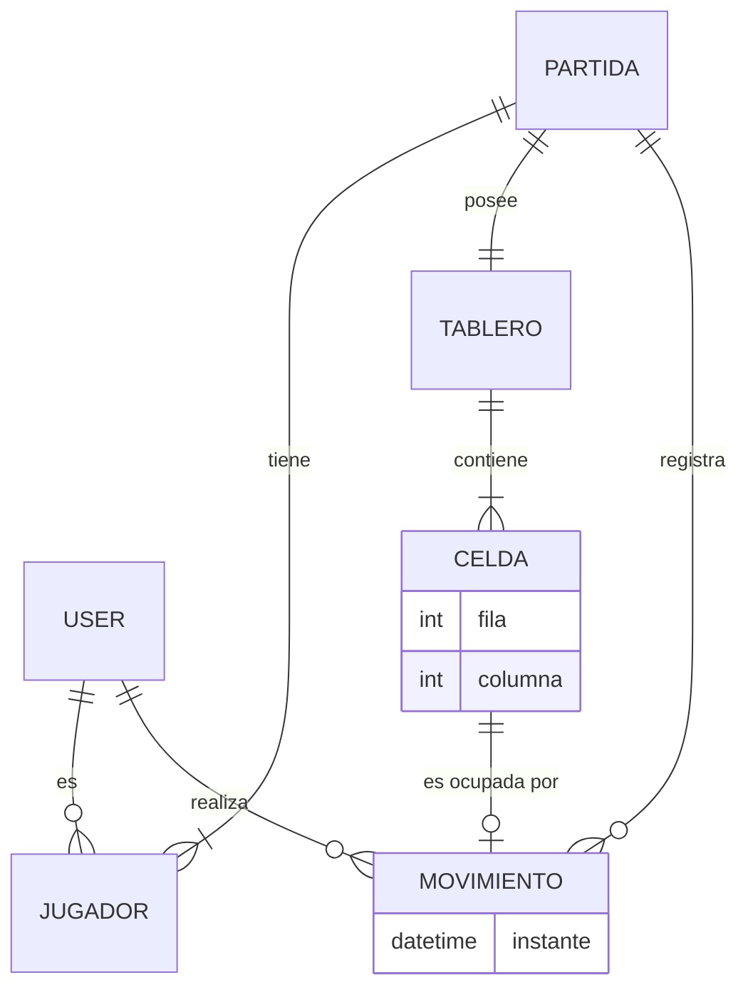

## Diagrama de E/R

```mermaid
---
id: 82614056-09fc-4982-bdf2-d10faf30cacc
---
erDiagram
    USER ||--o{ JUGADOR : "es"
    PARTIDA ||--|{ JUGADOR : "tiene"
    PARTIDA ||--|| TABLERO : "posee"
    TABLERO ||--|{ CELDA : "contiene"
    
    PARTIDA ||--o{ MOVIMIENTO : "registra"
    USER ||--o{ MOVIMIENTO : "realiza"
    CELDA ||--o| MOVIMIENTO : "es ocupada por"

    MOVIMIENTO {
        datetime instante
    }
    CELDA {
        int fila
        int columna
    }
```